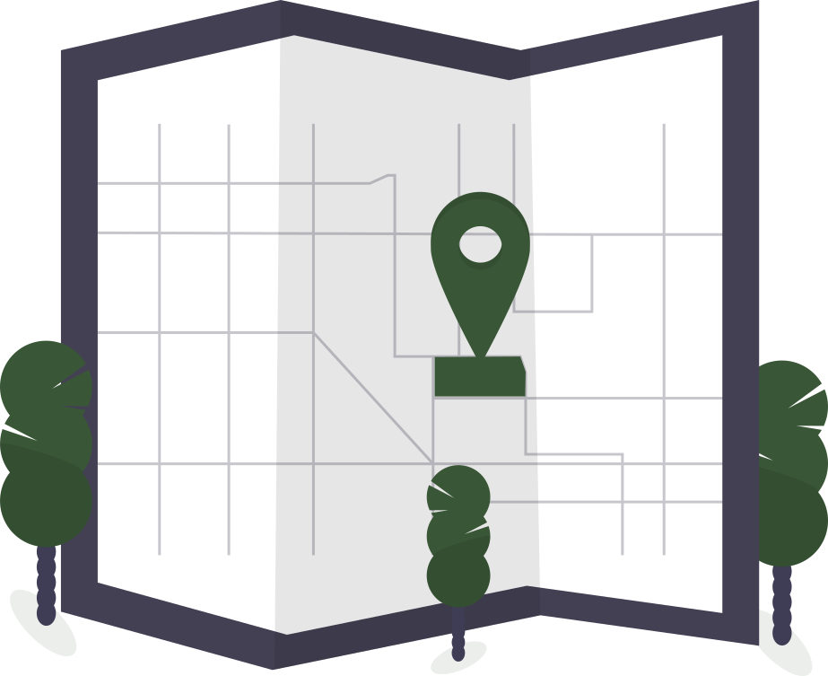

# Travelr

Wanderlust? Plan your next big adventure with Travelr!
Get inspired by remarkable sights, give them a like and search the world.
Pick the location of your choice and browse through the sights.
Add the ones you like and save them to your trip. Start exploring the world!

[Take a sneak peek at the App right here!](https://victoria-capstone-project.herokuapp.com/)

## Preview

## Installation and usage

This project was bootstrapped with [Create React App](https://github.com/facebook/create-react-app).

Further tooling:

- Styled-components
- Storybook
- Jest and React testing-libary

### Available Scripts

In the project directory, you can run:

#### `npm start`

Runs the app in the development mode.\
Open [http://localhost:3000](http://localhost:3000) to view it in the browser.

The page will reload if you make edits.\
You will also see any lint errors in the console.

#### `npm test`

Launches the test runner in the interactive watch mode.\
See the section about [running tests](https://facebook.github.io/create-react-app/docs/running-tests) for more information.

#### `npm run build`

Builds the app for production to the `build` folder.\
It correctly bundles React in production mode and optimizes the build for the best performance.

The build is minified and the filenames include the hashes.\
Your app is ready to be deployed!

## Now go and have fun discovering the world! 
